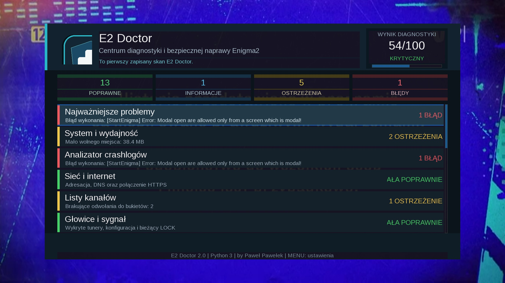

# E2 Doctor 2.3

E2 Doctor 2.3 to centrum diagnostyki i bezpiecznej naprawy dla tunerów Enigma2 z Pythonem 3.

## Języki

- automatycznie według języka systemu,
- polski,
- angielski.

Przy ustawieniu **Automatycznie** polski interfejs jest używany wyłącznie wtedy, gdy system Enigma2 działa po polsku. Dla każdego innego języka systemowego wtyczka uruchamia interfejs angielski.

## Interfejs 2.3

Wersja zawiera osobne, prawidłowo skalowane piktogramy dla ekranów HD i Full HD. Ikony nie są już przycinane przez renderer MultiContent Enigma2.

# E2 Doctor 2.2

Repozytorium zawiera źródła, paczkę IPK i pliki aktualizacji GitHub dla E2 Doctor 2.2.

# E2 Doctor 2.1

**E2 Doctor** to centrum diagnostyki, wyjaśniania problemów i bezpiecznej naprawy tunerów Enigma2 z Pythonem 3.

Autor: **by Paweł Pawełek**  
Kontakt: **aio-iptv@wp.pl**



## Najważniejsze funkcje

- pełna diagnostyka systemu, pamięci flash, RAM, obciążenia, czasu i temperatury,
- test sieci, DNS i połączenia HTTPS,
- kontrola list kanałów, `lamedb` i brakujących odwołań do bukietów,
- diagnostyka tunerów, sygnału, nośników, OPKG, OSCam, EPG i piconów,
- analiza crashlogów z próbą wskazania pliku, linii oraz podejrzanej wtyczki,
- wynik kondycji tunera w skali 0–100,
- historia skanów i porównanie zmian,
- Centrum szybkiej naprawy z działaniami dopasowanymi do wykrytego problemu,
- bezpieczne czyszczenie flash i odświeżenie pamięci RAM,
- analiza paczek IPK przed instalacją,
- raport techniczny i raport awaryjny,
- aktualizacja bezpośrednio z GitHub.

## Aktualizacja z GitHub

W panelu głównym wybierz moduł **Aktualizacja z GitHub** albo naciśnij klawisz **0**.

Aktualizator:

1. pobiera `update.json` z tego repozytorium,
2. sprawdza, czy dostępna jest nowsza wersja lub build,
3. pobiera paczkę IPK przez HTTPS,
4. weryfikuje jej sumę SHA-256,
5. instaluje paczkę dopiero po potwierdzeniu użytkownika,
6. po instalacji proponuje restart GUI Enigma2.

## Instalacja z pliku IPK

Skopiuj paczkę do `/tmp`, a następnie wykonaj:

```sh
opkg install --force-reinstall /tmp/enigma2-plugin-extensions-e2doctor_2.1_all.ipk
```

## Instalacja bezpośrednio z GitHub

```sh
wget -q -O - https://raw.githubusercontent.com/OliOli2013/E2-Doctor-Plugin/main/installer.sh | /bin/sh
```

## Zawartość repozytorium

- `src/` — pliki instalowane w systemie Enigma2,
- `packaging/control/` — pliki sterujące paczką IPK,
- `releases/` — gotowa paczka IPK używana przez aktualizator,
- `update.json` — dane najnowszego wydania i suma SHA-256,
- `build_ipk.sh` — budowanie paczki i automatyczna aktualizacja `update.json`,
- `installer.sh` — instalator online,
- `docs/` — grafiki i materiały projektu.

## Bezpieczeństwo

E2 Doctor nie przywraca ustawień fabrycznych, nie formatuje nośników i nie usuwa list kanałów. Operacje modyfikujące system wymagają potwierdzenia użytkownika. Paczka aktualizacji jest sprawdzana sumą SHA-256 przed instalacją.
